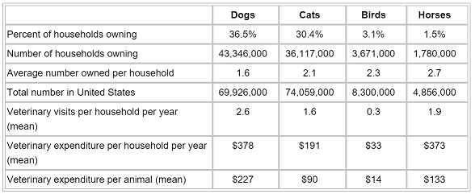

## Veterinarian ranks as fastest growing profession in United States  
  
<br>
<p>This means the pass-through of patients is increasing annually without an equivalent staff to accommodate.</p>
<p>To keep up, Veterinary Technicians and Assistants are required to know more and do more. 

## Knowledge and Accuracy
<font size="4">
<p>Included in this knowledge is medicine dosages, energy requirements, food requirements, fluid rates, rehydrations, and other equation based calculations.</p>
<p>Some of these calculations are complicated and, **if wrong, could impact a patients health**.</p>
<p>Because of the complexity and importance of these calculations, the **speed and accuracy are key**.</p>
<p>Just some of the calculations and equations used during an exam</p></font>
<font size="3", color="blue">
- Calculating Total Fluid Needs (TFN) in ml/hr and convert into drops/second.  
- Calculate doses in both mgs and mls.  
- Calculate Constant Rate Infusions (CRI’s)  
- Calculate CRI doses  
- Weight Conversions  
- Generic name for Name Brand equivalents  
...just to name a few
</font>

## Keeping up
<font size="3">
<p>In order to keep pace with the growing pass-through of patience, Vet Techs currently rely on:</p>
- Traditional equations, calculated by hand  
- Apps created on iPad  
- Apps online  

<p>The problem with these are:</p>
- Traditional methods can take too long, or worse, be inaccurate  
- Apps may not port over to all devices, leaving large gaps in availability
- Apps online are too cumbersome, hard to find, and are too simplistic
</font>

## Shiny App added
<font size="3">
<p> What if a Shiny App Vet-Tech calculator could be a supplement to current Veterinary software, so every piece of information and every calculation could be entered as data into a patients file?</p>
<p> Using simple exports and imports, an automation engineer could import data from a shiny app calculator into the existing software. Using a csv file or a sql database, any automation engineer worth his salt could make the import/export appear seamless. This would improve accuracy and performance of both Vet-Tech and doctor.</p>
</font>
<h1> So what might some of the calculators do?</h1>

## Dosage Calculator  

```{r, echo=FALSE}
shinyApp(
ui =  pageWithSidebar(
    headerPanel("Dosage Calculator"),
    fluidPage(
      fluidRow(
        column(1,
               numericInput('weight', 'Current Wt', 3, min = .1, max = 150, step = .1)
        ),
        column(2,
               selectInput("meds", label = "Medicines",
                           c("Acepromazine min dose" = 0.25,
                             "Acepromazine mean dose" = 0.625,
                             "Acepromazine max dose" = 1,
                             "Alprazolam min dose" = .005,
                             "Alprazolam mean dose" = .025,
                             "Alprazolam max dose" = .045,
                             "Amitriptyline min dose" = .5,
                             "Amitriptyline mean dose" = .125,
                             "Amitriptyline max dose" = 2,
                             "Amlodipine min dose" = .025,
                             "Amlodipine mean dose" = .0375,
                             "Amlodipine max dose" = .05,
                             "Amoxicillin min dose" = 5,
                             "Amoxicillin mean dose" = 7.5,
                             "Amoxicillin max dose" = 10,
                             "Atenolol min dose" = .125,
                             "Atenolol mean dose" = .3125,
                             "Atenolol max dose" = .5,
                             "Carprofen min dose" = 1,
                             "Carprofen mean dose" = 1.5,
                             "Carprofen max dose" = 2,
                             "Cephalexin min dose" = 10,
                             "Cephalexin mean dose" = 12.5,
                             "Cephalexin max dose" = 15,
                             "Chloramphenicol" = .25,
                             "Clindamycin min dose" = 12,
                             "Clindamycin mean dose" = 18,
                             "Clindamycin max dose" = 24))
        ),
        column(3,numericInput('age', 'age of animal in months', 0, min = 0, max = 300, step = 1))
      ),  # end of fluidRow
      submitButton('Calculate Doseage'),
      h3('Dosage to be administered - in mg'),
      verbatimTextOutput("medicine"),
      textOutput("age"),
      textOutput("weight"),


      br(),
      br(),
      h1('Dog Food Calculator'),
      h4('Your dog\'s ideal weight'),
      fluidRow(
        column(1,
               numericInput('idealWeight', 'Ideal Wt', 3, min = .1, max = 150, step = .1)
        ),
        column(2,
               selectInput("activity", label = "Your dog's activity level",
                           c("select an activity level..." = 0,
                             "Typical" = 1.6,
                             "Active" = 2,
                             "Overweight" = .75,
                             "Highly Active" = 3.5,
                             "Senior, neutered, inactive" = 1,
                             "Working Dog (light duty)" = 3,
                             "Working Dog (moderate duty)" = 4,
                             "Working Dog (heavy duty" = 5))
        ),
        column(3,numericInput('kcal', 'kcal/cup', 0, min = 0, max = 1300, step = 1))
      ),  # end of fluidRow

      submitButton('Calculate Calories'),
      h3('Calories to be consumed - per day'),
      verbatimTextOutput("activity"),
      textOutput("idealWeight"),
      textOutput("kcal"),
      br(),
      br()
    ),  # end of fluidPage
    textOutput("This appliction is A product of SquirlDar")
  ),
  
  server = function(input, output) {
    output$animalWeight <- renderText({input$weight})
    output$medicineLabel <- renderText({(input$meds)})
    output$medicine <- renderText(paste({(as.numeric(input$meds)*(input$weight))}, "mg doseage for", input$age, "month old dog weighing", input$weight, "pounds"))

    output$newWeight <- renderText({input$idealWeight})
    output$activityLabel <- renderText({input$activity})
    #output$activity <- renderText(paste("Feed", (round(((input$idealWeight * 70)^(3/4))) * {(as.numeric(input$activity))}), "calories for", input$age, "month old dog weighing", input$weight, "pounds. So feed", (input$kcal) ,"cups of your current food each day."))
    output$activity <- renderText(paste((round(((input$idealWeight * 70)^(3/4))) * {(as.numeric(input$activity))}) , "calories are required per day for a", input$age, "month old dog weighing", input$weight, "pounds. So feed", round((((input$idealWeight * 70)^(3/4))) * {(as.numeric(input$activity))} / input$kcal) ,"cups of your current dog food each day."))

  },
  
  options = list(height = 500)
)
```

This simple calculator holds values of "weight", "medicine", and "age", which can be used for other calculations; so you don't need to re-enter data, and to export to patient chart.

This simple calculator holds values of "weight", "pet food", and "age", which can be used for other calculations; so you don't need to re-enter data, and to export to patient chart.  

